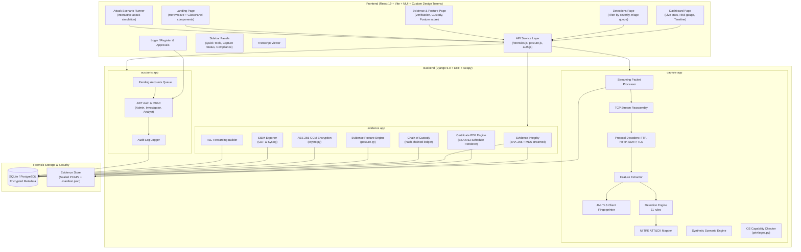
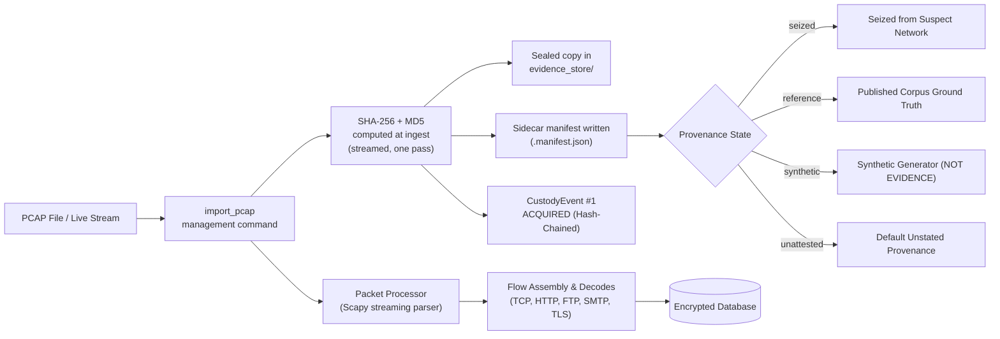
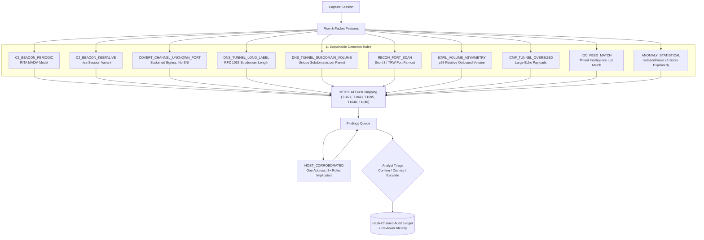
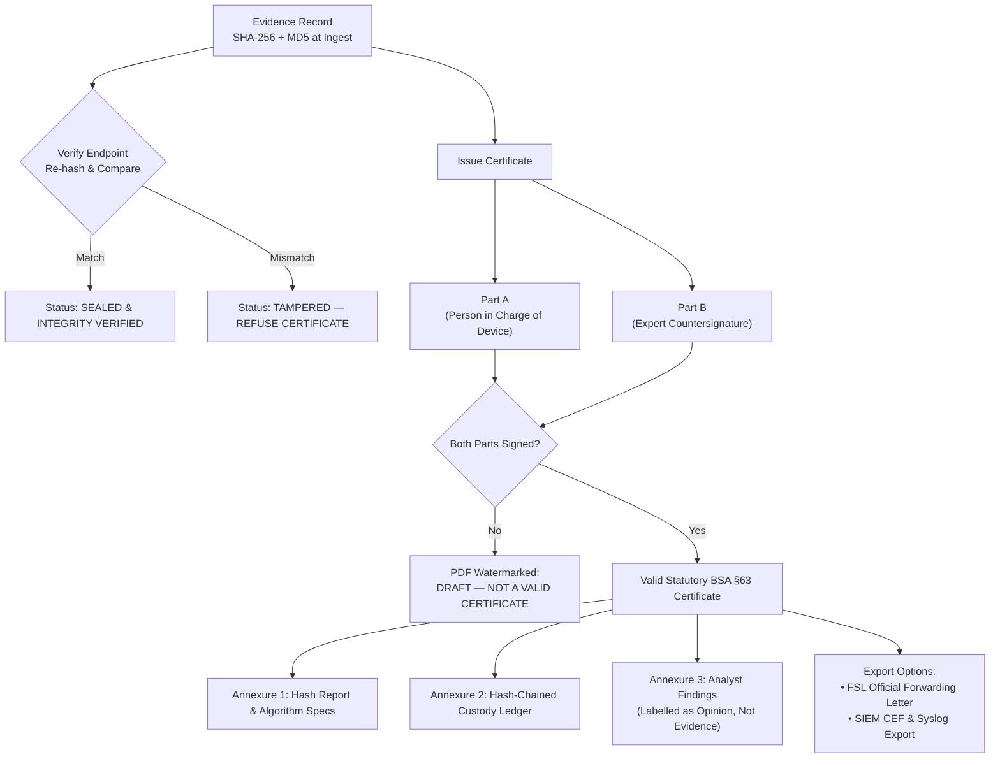

# NetForensiq

**Network and Packet Forensics Platform** — the chain-of-custody, evidence integrity, and legal admissibility layer that makes network evidence stand up in an Indian court under the **Bharatiya Sakshya Adhiniyam (BSA) 2023 §63**.

Built for **KANAD S.H.I.E.L.D. 2026** · Category 2, Problem Statement #8 (*Cyber Crime Investigation System*) · i-Hub Gujarat, Ahmedabad.

---

## What This Is

Arkime, Zeek, and Suricata show you packets. None of them produce a **BSA Section 63 certificate**, track the chain of custody with **cryptographic hash-chaining**, or explain to a judge *why* a flow was flagged — with a citable source for every threshold.

NetForensiq is not another packet analyser. It is the **legal admissibility and chain-of-custody layer** for network evidence in the Indian judicial system.

```mermaid
graph TD
    subgraph Scene ["Physical Crime Scene"]
        A["eSakshya App<br/>(Videographs physical crime scene & seizure)"]
    end

    subgraph Malkhana ["Police Malkhana"]
        B["CCTNS Property Register<br/>(Logs physical items: hard drives, phones)"]
    end

    subgraph Gap ["The Critical Legal Gap"]
        C["Network Evidence & Packet Captures<br/>(Volatile RAM, router SPAN taps, PCAP files)"]
    end

    subgraph NetForensiq ["NetForensiq Legal Admissibility Layer"]
        D["Ingest & Hash (SHA-256 + MD5 at line rate)"]
        E["Hash-Chained Chain of Custody Ledger"]
        F["11 Deterministic Detection Rules & MITRE Mapping"]
        G["BSA §63 Statutory Certificate PDF (Schedule)"]
    end

    C -- "falls between (no scene video)" --> A
    C -- "falls between (no physical malkhana log)" --> B
    C ==> "sealed, tracked & certified by" ==> D
    D --> E --> F --> G
```

> **eSakshya** seals *scene video*. **CCTNS Property Registers** track *physical objects*.
> A packet capture is neither — it has no physical scene to videograph and no physical object to log into a malkhana shelf. **Network evidence falls in the gap between the two systems, and nothing currently covers it.**

---

## System Architecture

NetForensiq is built with a modular, decoupled architecture consisting of a React 19 frontend, Django 6.0 backend, Scapy streaming packet engine, and an air-gapped forensic evidence store.



---

## Quick Start

### Prerequisites

- Python 3.10+
- Node.js 18+
- No database server required (SQLite by default)

### Backend Setup

```bash
cd backend
python3 -m venv .venv
./.venv/bin/pip install -r requirements.txt
./.venv/bin/python manage.py migrate
```

Fetch the real reference captures the engine is validated against — **do this before the event; nothing else in the project touches the network**:

```bash
./scripts/fetch_reference_captures.sh
```

Then seed a full demonstration dataset — accounts, sealed exhibits, findings, and a signed Section 63 certificate — in one command:

```bash
cd backend
./.venv/bin/python manage.py seed_demo

# add the generated capture too: it carries every attack class the engine
# detects, including the corroborated host, and is sealed as SYNTHETIC
./.venv/bin/python manage.py seed_demo --include-synthetic

./.venv/bin/python manage.py runserver 127.0.0.1:8000
```

`seed_demo` prefers the real reference captures and falls back to generated traffic only when they are absent — findings from traffic this codebase planted prove only that the generator and the detector agree. Its case reference is literally `DEMO-NOT-A-REAL-CASE`: it writes into the same database the dev server serves, and a plausible-looking FIR number would end up printed on a Section 63 certificate.

To take a capture into evidence by hand instead:

```bash
./.venv/bin/python manage.py suggest_home_net path/to/capture.pcap   # shows its working
./.venv/bin/python manage.py import_pcap path/to/capture.pcap \
    --name "Case capture" --case "I-CR-2026-0042" \
    --seized-from "Switch SPAN port, 3rd floor" \
    --home-net 10.3.14.0/24 --provenance seized --officer <username>
./.venv/bin/python manage.py analyze_session
```

### Frontend Setup

```bash
cd frontend
npm install
npm run dev
```

---

## Running Air-Gapped & Deployment Options

The platform is built for a forensic workstation with no internet. That claim is worth checking rather than believing, so here is exactly what is and is not true.

### 1. Zero Runtime Internet Dependencies
**Nothing needs a network at runtime.** No outbound request is made from either half of the application: there is no threat-intelligence feed to refresh, no geolocation lookup, no telemetry, and no CDN. Fonts are bundled into the build as npm packages rather than linked from Google Fonts, so the interface renders identically with the network interface down. `frontend/e2e/airgap.spec.js` enforces this by aborting every off-origin request the browser attempts and asserting that the list of them is empty.

### 2. Offline Bundle Installation
**What does need a network is installing it.** `pip install` reaches PyPI and `npm install` reaches the npm registry. That is the entire air-gap problem, and it is solved by doing both on the other side of the wall:

```bash
# On a machine WITH internet
./scripts/build_offline_bundle.sh
# → build/netforensiq-offline-<version>.tar.gz
```

The bundle carries every Python dependency as a pre-built wheel, the frontend already compiled to static files, the source, and a SHA-256 for every file. Carry it across on removable media, then:

```bash
# On the air-gapped machine
tar -xzf netforensiq-offline-<version>.tar.gz
cd netforensiq-offline-<version>
./scripts/install_offline.sh
```

`pip` runs with `--no-index`, so if anything were missing from the bundle the install fails immediately and names it rather than hanging on a socket that will never connect. The target machine needs **Python 3 and the POSIX utilities any Linux install already has** (`tar`, `sha256sum`, `grep`) — no Node, no compiler, no database server, and no package index. Wheels are specific to the OS, CPU architecture, and Python minor version; the bundle records what it was built for and the installer refuses a mismatch instead of failing later at import time.

### 3. Docker & Air-Gapped Containerization
For containerized air-gapped deployments:

```bash
# Build and run locally via Docker Compose
docker-compose up -d --build

# Save Docker images for air-gapped transport
./scripts/airgap_save_images.sh

# Load Docker images on target workstation
./scripts/airgap_load_images.sh
```

### 4. Single Process, Single Port Architecture
**One process, one port.** Django serves the API *and* the built interface (`backend/netforensiq_backend/spa.py`), so an officer starts one thing:

```bash
cd backend
FRONTEND_DIST=../frontend/dist .venv/bin/python manage.py runserver 127.0.0.1:8000
```

Paths the API owns still return real 404s rather than the app shell — a catch-all that answers `/api/typo` with HTML and status 200 turns a typo into a `JSON.parse` error a long way from its cause.

### 5. Hardware Clock Qualification
**The clock is the honest caveat.** An air-gapped machine has no NTP, and an undisciplined real-time clock drifts by seconds to minutes a month. Every timestamp this platform records comes from that clock. Rather than assert an accuracy the hardware cannot deliver, the §63 certificate prints the clock's state beside the timestamps it qualifies — synchronised, not synchronised, or unknown — and says what that means for the reader. See [`backend/evidence/timesource.py`](backend/evidence/timesource.py).

---

## Run Tests & Verification

```bash
# Everything: schema, backend suite, seeding, API, E2E, documented figures
./scripts/verify.sh
```

Or piecemeal:

```bash
# Backend: 447 tests
cd backend && ./.venv/bin/python manage.py test

# Frontend: 61 Playwright E2E tests
cd frontend && npx playwright test

# The counts above are measured, not remembered
python3 scripts/check_docs.py
```

Every number in this file that describes the code is checked by `scripts/check_docs.py`, which `verify.sh` runs on every phase. They had once drifted in three places at once: this file, PROGRESS.md, and the suite itself all gave different totals — on a project whose pitch is that every figure traces to something real, and on the cheapest claim here for a reviewer to check.

---

## How It Works

### 1. Ingest, Manifest Provenance, and Chain of Custody



The PCAP is hashed the moment it enters the system using streamed SHA-256 and MD5 passes. The sealed copy is never modified. Every subsequent access — verification, export, certificate generation — is logged as a `CustodyEvent`, and each event digests its predecessor so that altering any past entry breaks every link after it.

#### Provenance travels with the bytes
A capture we generated and a capture seized from a suspect's network are byte-identical artefacts: same hash, same custody chain, same certificate. Without a recorded statement of origin, a demonstration PDF is indistinguishable from a statutory declaration over real evidence — the most dangerous thing this codebase could ship.

So every file carries a sidecar manifest saying where it came from, written by whatever produced or fetched it, digest included so it cannot be detached and reattached to a different capture. Intake reads it, and four states are possible:

| Provenance | Meaning |
|---|---|
| `seized` | Declared at intake by an officer as taken from a network under investigation |
| `reference` | Real traffic from a published corpus, with the source and ground-truth URLs recorded |
| `synthetic` | Generated by this software. **Not evidence.** |
| `unattested` | Nobody stated an origin — the default, because a file arriving with no statement has not thereby been shown to be real |

A synthetic exhibit is stamped `SYNTHETIC DATA — NOT EVIDENCE` across the top of its Section 63 certificate and flagged in red on the evidence register. Guessing "this looks synthetic" from packet contents would be a heuristic, and a heuristic wrong in either direction is worse than no claim at all.

#### What the manifest is not
It is not a security control. Anyone who can write to the capture directory can write a manifest, and it is not signed — signing would only move the question to who holds the key. What it does is make an *accident* impossible: a demonstration capture cannot quietly become an exhibit because someone lost track of which file was which. Every failure mode closes in the alarming direction — a missing, unreadable, or mismatched manifest yields `unattested`, never `seized` — and the manifest is copied into the evidence store beside the sealed file, so re-processing an exhibit does not lose what is known about it.

`seed_demo` refuses to run at all when `ALLOWED_HOSTS` names anything beyond loopback: it creates accounts with a password printed in its own help text, and on a deployment that is an unauthenticated account and fabricated exhibits in a case register.

#### Readable by a Gujarati-medium officer, where it can be rendered correctly
The evidence register carries a Gujarati gloss of the legal terms — `મુદ્દામાલ ક્રમાંક` (exhibit number), `કબજાની સાંકળ` (chain of custody), `ભારતીય સાક્ષ્ય અધિનિયમ` — with English authoritative throughout. The certificate PDF is deliberately **not** translated: ReportLab does not shape complex scripts, so `અધિનિયમ` renders as `અધનિયિમ` and `સ્થળ` loses its virama. Mangled Gujarati on a statutory declaration is worse than English only. The rendered comparison is in [research/99](research/99_GUJARAT_FIT.md).

#### Every finding names the exhibit it rests on
A capture session carries a foreign key to the sealed record it analysed, so an assertion about traffic can be traced to a hashed artefact in custody — and a finding from a capture imported with `--no-seal` says `not in evidence` rather than looking like every other row. Deleting an exhibit is refused while any analysis of it exists.

---

### 2. Detection Engine & MITRE ATT&CK Mapping

Rules first, model second. A police panel will ask "why did it flag this?" — a rule answers, a black box does not.



`HOST_CORROBORATED` is an 11th detector. It takes no measurement of its own and can only restate what the rules already found — which is exactly why it is the one thing in the engine allowed to say **CRITICAL**. One rule firing is a prompt to look; the same address turning up under three unrelated rules is the shape of an incident, and an officer working three hundred findings should not have to spot that by eye.

#### Key Design Decisions

- **Every threshold carries its source**, published at `GET /api/detections/thresholds/`. Values we invented are tagged `[OUR HEURISTIC]` and that tag travels into each finding.
- **DNS findings aggregate per (source, parent domain)** — one alert per tunnel, not 54 near-identical rows.
- **Exfiltration volume is relative to the capture** (p95 outbound, floored at 100 KB). A fixed byte threshold cannot work across capture scales.
- **`HOME_NET` (like Snort's `$HOME_NET`) ensures egress rules fire only on internal hosts** — and it is declared **per capture**, not per install. A capture taken inside an office is RFC 1918; a capture of a public-facing server is not. Analysing both against one global setting means one of them is analysed against the wrong network and every egress rule silently inverts. That defect produced 7,052 false alerts before it was found.

  `manage.py suggest_home_net <pcap>` reads a proposal off the traffic and shows its working; it deliberately does not apply it. An inferred value applied silently is a guess wearing the clothes of a measurement.

- **JA4, not JA3.** The TLS client fingerprint is JA4 (FoxIO). JA3 was retired — Salesforce's own README points at the successor, and since Chrome 110 randomised ClientHello extension order in 2023 a real browser produces a different JA3 on every connection. JA4 sorts the lists before hashing, which is what survives that. The implementation is checked against the reference values published with the specification, and each flow stores the sorted cipher and extension lists in the clear beside the hash, so an analyst asked in court why two flows match can point at the values rather than at twelve hex characters.

- **A protocol read off the wire and one guessed from the port are different claims.** "HTTPS because a ClientHello was parsed" and "HTTPS because the port was 443" are stored separately and the dashboard says which — a covert channel on a permitted port is precisely the case where the guess is wrong.

- **Threat Intelligence Feed Matching (`IOC_FEED_MATCH`).** Matches flows against imported threat intelligence lists (abuse.ch, CERT-In, FSL lists). It is capped at HIGH severity (borrowed evidence must not outrank measured statutory evidence) and records the temporal distance between capture and feed compilation to avoid false positives from stale IP reassignments.

- **IsolationForest Anomaly Detection (`ANOMALY_STATISTICAL`).** Implemented as a secondary signal in `capture/anomaly.py`. It is bounded by three strict conditions: (1) Capped at MEDIUM severity; (2) Always explained via signed z-scores (`unusual_features`); (3) Labelled as statistical (`method = model`). Flows isolated without an explicit feature explanation are dropped rather than reported.

---

### 3. Evidence Integrity and BSA Section 63 Certificates



The certificate PDF reproduces **THE SCHEDULE** to the Bharatiya Sakshya Adhiniyam 2023 verbatim — the same wording, field order, and tick-boxes that appear in the bare Act. Two rules govern the renderer:

1. **Statutory blanks stay blank.** Where we do not hold a fact the Schedule asks for (a parent's name, the device's colour), the line is printed empty for a human to complete in ink. Filling it with a plausible value would be forging a statutory declaration.

2. **An unsigned certificate is visibly unsigned.** Section 63(4) requires Part A and Part B conjunctively. A PDF missing either is watermarked `DRAFT — NOT A VALID CERTIFICATE` across every page.

---

## API Reference

### Capture and Detection API

| Method | Endpoint | Purpose |
|---|---|---|
| `GET` | `/api/sessions/` | List capture sessions |
| `GET` | `/api/sessions/{id}/` | Session detail |
| `POST` | `/api/sessions/{id}/analyse/` | Run detection rules |
| `GET` | `/api/sessions/{id}/summary/` | Dashboard aggregates |
| `GET` | `/api/sessions/{id}/timeline/` | Activity bucketed over time |
| `GET` | `/api/flows/` | List flows (filter by session, protocol, IP, flagged) |
| `GET` | `/api/flows/{id}/` | Flow detail with all features and JA4 hash |
| `GET` | `/api/dns/` | DNS records (filter by session, label length) |
| `GET` | `/api/detections/` | Detection findings (filter by session, severity, triage) |
| `POST` | `/api/detections/{id}/triage/` | Analyst confirm / dismiss / escalate |
| `GET` | `/api/detections/thresholds/` | Every threshold with its provenance citation |

### Evidence, Posture, and Certificates API

| Method | Endpoint | Purpose |
|---|---|---|
| `GET` | `/api/evidence/` | List evidence records |
| `GET` | `/api/evidence/{id}/` | Evidence detail (hashes, device info) |
| `POST` | `/api/evidence/{id}/verify/` | Re-hash and compare against stored digest |
| `GET` | `/api/evidence/posture/` | Real-time evidence posture & statutory compliance score |
| `POST` | `/api/evidence/{id}/certificate/` | Issue a BSA s.63 certificate draft |
| `GET` | `/api/certificates/` | List issued certificates |
| `POST` | `/api/certificates/{id}/sign/` | Countersign Part A or Part B (expert) |
| `GET` | `/api/certificates/{id}/pdf/` | Download rendered certificate PDF |
| `GET` | `/api/evidence/{id}/siem/` | Export evidence findings in SIEM CEF/Syslog format |
| `GET` | `/api/evidence/{id}/fsl/` | Download FSL Forwarding Letter DOCX/PDF |

### Account Approval API

| Method | Endpoint | Purpose |
|---|---|---|
| `GET` | `/api/auth/accounts/pending/` | Applications awaiting a decision (Administrator only) |
| `POST` | `/api/auth/accounts/pending/` | `{"username": "...", "decision": "approve"|"reject"}` |

Approving an officer decides who may touch evidence at all, and it was previously possible only through the Django admin — the one act the system cares most about, happening outside the system. Rejection deactivates rather than deletes: the application and the decision on it stay on the record. The audit entry is written by a signal on the User model, so a decision made here and one made in the Django admin are recorded identically.

### Authentication API

| Method | Endpoint | Purpose |
|---|---|---|
| `POST` | `/api/auth/register/` | Register (role, badge_id, department) |
| `POST` | `/api/auth/login/` | Obtain JWT token pair |
| `POST` | `/api/auth/login/refresh/` | Refresh access token |
| `GET` | `/api/auth/me/` | Current user profile |
| `GET` | `/api/auth/status/` | Registration approval status |
| `POST` | `/api/auth/logout/` | Blacklist refresh token & record sign-out |

Signing out blacklists the refresh token server-side and writes an `AuditLog.Action.LOGOUT` row. Clearing sessionStorage alone would leave the token usable for its full lifetime. All endpoints require authentication (`IsAuthenticated`) by default. Registration requires admin approval before the account is active.

---

## Detection Rules Reference

| Rule ID | What It Detects | Threshold Source |
|---|---|---|
| `C2_BEACON_PERIODIC` | Repeated connections with regular timing (RITA model) | RITA `analyzer.go` — MADM / median interval |
| `C2_BEACON_KEEPALIVE` | Periodic traffic inside a single persistent session | Same MADM formula, applied intra-connection `[OUR HEURISTIC]` |
| `COVERT_CHANNEL_UNKNOWN_PORT` | Sustained egress to a non-well-known port with no TLS SNI | Curated sustained-session port list `[OUR HEURISTIC]` |
| `DNS_TUNNEL_LONG_LABEL` | Subdomain labels longer than 52 characters | RFC 1035 §2.3.4 (label ≤63); dnscat2 `MAX_FIELD_LENGTH=62`; iodine `-M` |
| `DNS_TUNNEL_SUBDOMAIN_VOLUME` | Many unique subdomains under one parent domain | Scaled session volume threshold `[OUR HEURISTIC]` |
| `RECON_PORT_SCAN` | One source probing many service ports on one host | Snort 3 `port_scan` (ports=25) & TRW algorithm (Jung et al. 2004) |
| `EXFIL_VOLUME_ASYMMETRY` | Outbound volume exceeding p95 for the capture | Relative threshold, floored at 100 KB `[OUR HEURISTIC]` |
| `ICMP_TUNNEL_OVERSIZED` | Oversized ICMP echo payloads in a sustained stream | ping(8) baseline (56 B Linux / 32 B Windows) + `[OUR HEURISTIC]` |
| `IOC_FEED_MATCH` | Matches traffic against imported threat intelligence lists | Threat Intelligence Feed import (abuse.ch / CERT-In / FSL) |
| `ANOMALY_STATISTICAL` | IsolationForest outlier scoring with feature z-scores | scikit-learn IsolationForest (capped at MEDIUM severity) |
| `HOST_CORROBORATED` | One address implicated by three or more independent rules | Multi-rule corroboration logic `[OUR HEURISTIC]` |

Eleven rule IDs from eight rule functions plus post-pass corroboration: `rule_beaconing` emits two IDs, and `HOST_CORROBORATED` runs over the other rules' output. The list is declared as `RULE_IDS` in `detection.py`, pinned to what the source actually emits by a test, and served to the public landing page through `GET /api/engine/` — so the rule count on screen cannot drift from the code.

**35 thresholds, of which 12 carry an external citation and 23 are ours.** The claim is not that every threshold is sourced; it is that every threshold says which it is. `[OUR HEURISTIC]` travels into the stored evidence of each finding that used one, and `GET /api/detections/thresholds/` publishes the whole table.

---

## Project Structure

```
NetForensiq/
  backend/
    accounts/           Auth, roles, audit log, pending account approvals
    capture/            Packet processing, flow assembly, detection engine
      detection.py      11 rule IDs + published threshold registry
      features.py       Shannon entropy, DNS features, interval statistics
      home_net.py       Proposes monitored network from traffic
      processor.py      Scapy streaming parser, flow assembly, TLS/DNS/HTTP/FTP/SMTP
      provenance.py     Sidecar manifests: where a capture came from
      tls_fingerprint.py  JA4 client fingerprinting (FoxIO spec)
      scenario.py       Attack scenario simulation runner
      privileges.py     OS raw network capture capability checker
      reassembly.py     TCP stream reassembly engine
      protocols.py      Application protocol decoders
      attack_mapping.py MITRE ATT&CK matrix mapper
      ioc.py            Threat intelligence feed matcher
    evidence/           Evidence integrity, chain of custody, BSA s.63 certificates
      certificate_pdf.py  536-line PDF renderer reproducing THE SCHEDULE
      models.py         EvidenceRecord, CustodyEvent, Section63Certificate
      service.py        Issue, sign, verify, custody operations
      posture.py        Evidence posture & statutory compliance score engine
      crypto.py         AES-256 GCM metadata encryption at rest
      siem.py           CEF & Syslog SIEM exporter
    netforensiq_backend/  Django project settings and URL routing
  frontend/
    src/
      pages/            Dashboard, Detections, Evidence, Login, Register, Status, Approvals, Landing
      services/         API client (forensics.js, posture.js, auth.js)
      components/       Design tokens (tokens.js), GlassPanel, HeroWeave, EvidencePosture,
                        SidebarPanels (Quick Tools, Status, Compliance), AttackScenario
    e2e/                Playwright test suite (61 E2E tests)
  research/             21 research documents (legal, technical, intelligence, literature)
  docs/                 Project analysis, legal compliance generator, build history
  scripts/              verify.sh, check_docs.py, build_offline_bundle.sh, install_offline.sh,
                        airgap_save_images.sh, airgap_load_images.sh
```

---

## Validation Against Real Traffic

The detection engine was tested against two captures from [malware-traffic-analysis.net](https://www.malware-traffic-analysis.net), neither produced by us:

| Capture | Purpose | Result |
|---|---|---|
| AsyncRAT + XWorm infection (44 MB, 46k packets) | True positive test | Found 5 of 7 documented C2 flows, 0 false positives |
| One week of server scans (28 MB, 362k packets) | False positive test | Reduced from 7,052 to 307 alerts after fixes |

This validation found six defects that were invisible to the synthetic corpus. Full details: [research/96_REAL_TRAFFIC_VALIDATION.md](research/96_REAL_TRAFFIC_VALIDATION.md).

**What these numbers are not.** Two captures is not an evaluation. There is no measured precision or recall here and none should be claimed. The 5-of-7 result is against one sample's published ground truth; the two missed flows lasted 7 s and 13 s, below the sustained-session floor. The 307 findings on the server capture are consistent with a capture titled *"one week of server scans and probes"* — each is a distinct scanning host — but they have not been individually confirmed.

---

## Research Backing

| Document | Content |
|---|---|
| [SPEC_01_EVIDENCE_INTEGRITY.md](research/SPEC_01_EVIDENCE_INTEGRITY.md) | BSA s.63 verbatim, THE SCHEDULE field list, schema |
| [SPEC_02_DETECTION_ALGORITHMS.md](research/SPEC_02_DETECTION_ALGORITHMS.md) | RITA/Snort/binwalk/JA3/JA4 parameters with sources |
| [SPEC_03_CONNECTORS_AND_MCP.md](research/SPEC_03_CONNECTORS_AND_MCP.md) | Open feeds worth wiring in; Indian gov APIs |
| [93_NETFORENSIQ_CODE_REVIEW.md](research/93_NETFORENSIQ_CODE_REVIEW.md) | End-to-end code review that produced the build plan |
| [95_ESAKSHYA_VERIFIED_FINDINGS.md](research/95_ESAKSHYA_VERIFIED_FINDINGS.md) | eSakshya gap analysis, claim-by-claim verification |
| [96_REAL_TRAFFIC_VALIDATION.md](research/96_REAL_TRAFFIC_VALIDATION.md) | Real-traffic test results and defects found |
| [99_GUJARAT_FIT.md](research/99_GUJARAT_FIT.md) | Gujarat cybercrime ecosystem & ReportLab virama rendering analysis |
| [140_SIDEBAR_FEATURE_RESEARCH.md](research/140_SIDEBAR_FEATURE_RESEARCH.md) | Quick forensic tools & legal drawer panel specifications |
| [141_ARXIV_STATE_OF_ART.md](research/141_ARXIV_STATE_OF_ART.md) | Literature review on explainable network packet forensics |

---

## Test Coverage

- **447 backend tests** — feature maths, timestamp fidelity, all attack types, benign-traffic false-positive guard, DNS aggregation, threshold provenance, IPv6, hashing, tamper detection, custody-chain breakage, certificate refusal on failed integrity, AES-256 GCM encryption, evidence posture calculation.
- **61 Playwright E2E tests** — auth guard, dashboard figures matching the API, absence of placeholder strings, threshold inspection, triage round-trip, custody verdict, certificate download, air-gap network request abortion.

---

## Configuration

Copy `backend/.env.example` to `backend/.env` and adjust as needed:

| Variable | Default | Purpose |
|---|---|---|
| `SECRET_KEY` | auto-generated | Django secret key. Ephemeral by default so a fresh clone runs; set it or every restart invalidates all tokens |
| `DEBUG` | `False` | Django debug mode |
| `ALLOWED_HOSTS` | `localhost,127.0.0.1` | Hostnames this instance answers on |
| `DB_NAME` | (none — uses SQLite) | PostgreSQL database name |
| `HOME_NET` | `10.0.0.0/8,…` (RFC 1918) | **Fallback only.** The monitored network is declared per capture at import; this is used when a capture declares none |
| `CACHE_BACKEND` / `CACHE_LOCATION` | file-based, `backend/.cache` | Where DRF's throttle counters live — this decides whether the login rate limit is real. Point at Redis in a deployment |
| `MEDIA_ROOT` | `backend/evidence_store` | Where sealed evidence and rendered certificates are written |
| `EXHIBIT_PREFIX` / `CERTIFICATE_PREFIX` | `NF` / `S63` | Identifier schemes. Most units have their own; ours should not appear on a case file |
| `ISSUING_ORGANISATION` | (none) | Printed on the certificate as the issuing body. Blank prints nothing rather than inventing one |
| `CORS_EXTRA_ORIGINS` | (none) | Additional allowed CORS origins |
| `VITE_API_BASE` | dev: `http://127.0.0.1:8000/api` | Frontend build-time API address. A production build without it falls back to same-origin `/api` and says so in the console |

**Rate limits** (`REST_FRAMEWORK.DEFAULT_THROTTLE_RATES`): login 8/hour, registration 5/hour, approval-status check 20/hour, anonymous 30/hour, authenticated 1000/hour. The three public endpoints are scoped separately because they fail differently — login leaks credentials to a guesser, registration floods the queue an administrator has to work through, and the status check answers "does this username hold this badge" for anyone who asks.

---

## Ground Rules

1. **No hardcoded demo data.** Every number on screen comes from the database, including the rule count and version on the pre-auth landing page. Guarded by E2E tests on both public and authenticated pages.
2. **No fake affordances.** If a control is rendered, it does something.
3. **No invented thresholds.** Detection parameters carry a citation or are explicitly labelled `[OUR HEURISTIC]`, and that tag travels into the stored evidence of every finding that used one. A test fails the build if a published threshold is read by no rule.
4. **No overclaiming.** Synthetic results are labelled synthetic; no precision or recall is claimed from three captures.
5. **A demonstration must not be able to pass itself off as a case by accident.** Provenance is recorded for every capture, carried into the evidence store, and printed on every certificate. It is not a security control — anyone who can write to the capture directory can write a manifest — but every failure mode closes in the alarming direction, so losing track of which file is which cannot silently produce an exhibit.
6. **The documented figures are measured**, by `scripts/check_docs.py`, on every phase.
7. `./scripts/verify.sh` at the end of every phase.

---

## License

This project was built for the KANAD S.H.I.E.L.D. 2026 hackathon. Licensing terms to be determined.
