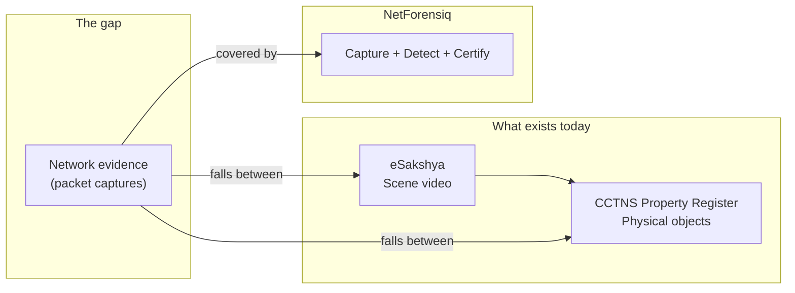
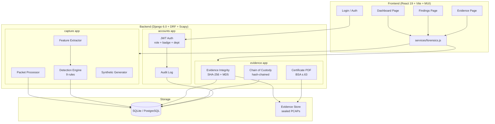
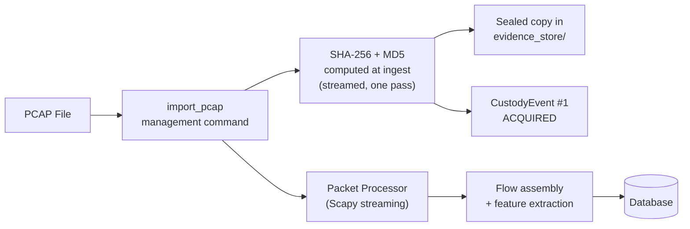
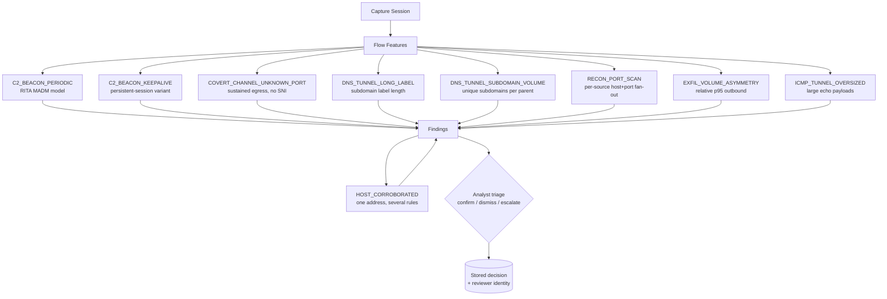
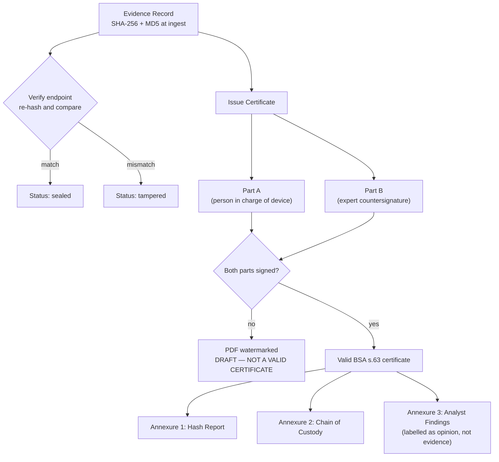

# NetForensiq

**Network and Packet Forensics Platform** — the chain-of-custody layer that makes
network evidence stand up in an Indian court.

Built for KANAD S.H.I.E.L.D. 2026 · Category 2, Problem Statement #8
(Cyber Crime Investigation System) · i-Hub Gujarat, Ahmedabad

---

## What This Is

Arkime, Zeek, and Suricata show you packets. None of them produce a
BSA Section 63 certificate, track the chain of custody with hash-chaining, or explain
to a judge *why* a flow was flagged — with a citable source for every threshold.

NetForensiq is not another packet analyser. It is the **legal admissibility layer**
for network evidence in the Indian judicial system.



> eSakshya seals *scene video*. CCTNS Property Registers track *physical objects*.
> A packet capture is neither — it has no scene to videograph and no object to log
> into a malkhana. **Network evidence falls in the gap between the two systems, and
> nothing currently covers it.**

---

## Architecture



---

## Quick Start

### Prerequisites

- Python 3.10+
- Node.js 18+
- No database server required (SQLite by default)

### Backend

```bash
cd backend
python3 -m venv .venv
./.venv/bin/pip install -r requirements.txt
./.venv/bin/python manage.py migrate
```

Fetch the real captures the engine is validated against — **do this before the
event; nothing else in the project touches the network**:

```bash
./scripts/fetch_reference_captures.sh
```

Then seed a full demonstration dataset — accounts, sealed exhibits, findings and
a signed Section 63 certificate — in one command:

```bash
cd backend
./.venv/bin/python manage.py seed_demo

# add the generated capture too: it carries every attack class the engine
# detects, including the corroborated host, and is sealed as SYNTHETIC
./.venv/bin/python manage.py seed_demo --include-synthetic

./.venv/bin/python manage.py runserver 127.0.0.1:8011
```

`seed_demo` prefers the real reference captures and falls back to generated
traffic only when they are absent — findings from traffic this codebase planted
prove only that the generator and the detector agree. Its case reference is
literally `DEMO-NOT-A-REAL-CASE`: it writes into the same database the dev server
serves, and a plausible-looking FIR number would end up printed on a Section 63
certificate.

To take a capture into evidence by hand instead:

```bash
./.venv/bin/python manage.py suggest_home_net path/to/capture.pcap   # shows its working
./.venv/bin/python manage.py import_pcap path/to/capture.pcap \
    --name "Case capture" --case "I-CR-2026-0042" \
    --seized-from "Switch SPAN port, 3rd floor" \
    --home-net 10.3.14.0/24 --provenance seized --officer <username>
./.venv/bin/python manage.py analyze_session
```

### Frontend

```bash
cd frontend
npm install
npm run dev
```

### Run Tests

```bash
# Everything: schema, backend suite, seeding, API, E2E, documented figures
./scripts/verify.sh
```

Or piecemeal:

```bash
# Backend: 121 tests
cd backend && ./.venv/bin/python manage.py test

# Frontend: 50 Playwright E2E tests
cd frontend && npx playwright test

# The counts above are measured, not remembered
python3 scripts/check_docs.py
```

Every number in this file that describes the code is checked by
`scripts/check_docs.py`, which `verify.sh` runs on every phase. They had once drifted
in three places at once: this file, PROGRESS.md and the suite itself all gave
different totals — on a project whose pitch is that every figure traces to
something real, and on the cheapest claim here for a reviewer to check.

---

## How It Works

### 1. Capture and Ingest



The PCAP is hashed the moment it enters the system. The sealed copy is never
modified. Every subsequent access — verification, export, certificate generation —
is logged as a `CustodyEvent`, and each event digests its predecessor so that
altering any past entry breaks every link after it.

**Provenance travels with the bytes.** A capture we generated and a capture
seized from a suspect's network are byte-identical artefacts: same hash, same
custody chain, same certificate. Without a recorded statement of origin, a
demonstration PDF is indistinguishable from a statutory declaration over real
evidence — the most dangerous thing this codebase could ship.

So every file carries a sidecar manifest saying where it came from, written by
whatever produced or fetched it, digest included so it cannot be detached and
reattached to a different capture. Intake reads it, and four states are possible:

| Provenance | Meaning |
|---|---|
| `seized` | Declared at intake by an officer as taken from a network under investigation |
| `reference` | Real traffic from a published corpus, with the source and ground-truth URLs recorded |
| `synthetic` | Generated by this software. **Not evidence.** |
| `unattested` | Nobody stated an origin — the default, because a file arriving with no statement has not thereby been shown to be real |

A synthetic exhibit is stamped `SYNTHETIC DATA — NOT EVIDENCE` across the top of
its Section 63 certificate and flagged in red on the evidence register. Guessing
"this looks synthetic" from packet contents would be a heuristic, and a heuristic
wrong in either direction is worse than no claim at all.

**What the manifest is not.** It is not a security control. Anyone who can
write to the capture directory can write a manifest, and it is not signed —
signing would only move the question to who holds the key. What it does is make
an *accident* impossible: a demonstration capture cannot quietly become an
exhibit because someone lost track of which file was which. Every failure mode
closes in the alarming direction — a missing, unreadable or mismatched manifest
yields `unattested`, never `seized` — and the manifest is copied into the
evidence store beside the sealed file, so re-processing an exhibit does not lose
what is known about it.

`seed_demo` refuses to run at all when `ALLOWED_HOSTS` names anything beyond
loopback: it creates accounts with a password printed in its own help text, and
on a deployment that is an unauthenticated account and fabricated exhibits in a
case register.

**Readable by a Gujarati-medium officer, where it can be rendered correctly.**
The evidence register carries a Gujarati gloss of the legal terms —
`મુદ્દામાલ ક્રમાંક` (exhibit number), `કબજાની સાંકળ` (chain of custody),
`ભારતીય સાક્ષ્ય અધિનિયમ` — with English authoritative throughout. The
certificate PDF is deliberately **not** translated: ReportLab does not shape
complex scripts, so `અધિનિયમ` renders as `અધનિયિમ` and `સ્થળ` loses its virama.
Mangled Gujarati on a statutory declaration is worse than English only. The
rendered comparison is in [research/99](research/99_GUJARAT_FIT.md).

**Every finding names the exhibit it rests on.** A capture session carries a
foreign key to the sealed record it analysed, so an assertion about traffic can
be traced to a hashed artefact in custody — and a finding from a capture
imported with `--no-seal` says `not in evidence` rather than looking like every
other row. Deleting an exhibit is refused while any analysis of it exists.

### 2. Detection Engine

Rules first, model second. A police panel will ask "why did it flag this?" — a
rule answers, a black box does not.



`HOST_CORROBORATED` is not a ninth detector. It takes no measurement of its own
and can only restate what the rules already found — which is exactly why it is
the one thing in the engine allowed to say **CRITICAL**. One rule firing is a
prompt to look; the same address turning up under three unrelated rules is the
shape of an incident, and an officer working three hundred findings should not
have to spot that by eye.

**Key design decisions:**

- Every threshold carries its source, published at `GET /api/detections/thresholds/`.
  Values we invented are tagged `[OUR HEURISTIC]` and that tag travels into each finding.
- DNS findings aggregate per (source, parent domain) — one alert per tunnel, not 54
  near-identical rows.
- Exfiltration volume is relative to the capture (p95 outbound, floored at 100 KB).
  A fixed byte threshold cannot work across capture scales.
- `HOME_NET` (like Snort's `$HOME_NET`) ensures egress rules fire only on internal
  hosts — and it is declared **per capture**, not per install. A capture taken
  inside an office is RFC 1918; a capture of a public-facing server is not.
  Analysing both against one global setting means one of them is analysed
  against the wrong network and every egress rule silently inverts. That defect
  produced 7,052 false alerts before it was found.

  `manage.py suggest_home_net <pcap>` reads a proposal off the traffic and shows
  its working; it deliberately does not apply it. An inferred value applied
  silently is a guess wearing the clothes of a measurement.

- **JA4, not JA3.** The TLS client fingerprint is JA4 (FoxIO). JA3 was retired —
  Salesforce's own README points at the successor, and since Chrome 110
  randomised ClientHello extension order in 2023 a real browser produces a
  different JA3 on every connection. JA4 sorts the lists before hashing, which
  is what survives that. The implementation is checked against the reference
  values published with the specification, and each flow stores the sorted
  cipher and extension lists in the clear beside the hash, so an analyst asked
  in court why two flows match can point at the values rather than at twelve
  hex characters.

- **A protocol read off the wire and one guessed from the port are different
  claims.** "HTTPS because a ClientHello was parsed" and "HTTPS because the port
  was 443" are stored separately and the dashboard says which — a covert channel
  on a permitted port is precisely the case where the guess is wrong.

### 3. Evidence Integrity and BSA Section 63 Certificates



The certificate PDF reproduces THE SCHEDULE to the Bharatiya Sakshya Adhiniyam 2023
verbatim — the same wording, field order, and tick-boxes that appear in the bare Act.
Two rules govern the renderer:

1. **Statutory blanks stay blank.** Where we do not hold a fact the Schedule asks for
   (a parent's name, the device's colour), the line is printed empty for a human to
   complete in ink. Filling it with a plausible value would be forging a statutory
   declaration.

2. **An unsigned certificate is visibly unsigned.** Section 63(4) requires Part A and
   Part B conjunctively. A PDF missing either is watermarked `DRAFT — NOT A VALID
   CERTIFICATE` across every page.

---

## API Reference

### Capture and Detection

| Method | Endpoint | Purpose |
|---|---|---|
| GET | `/api/sessions/` | List capture sessions |
| GET | `/api/sessions/{id}/` | Session detail |
| POST | `/api/sessions/{id}/analyse/` | Run detection rules |
| GET | `/api/sessions/{id}/summary/` | Dashboard aggregates |
| GET | `/api/sessions/{id}/timeline/` | Activity bucketed over time |
| GET | `/api/flows/` | List flows (filter by session, protocol, IP, flagged) |
| GET | `/api/flows/{id}/` | Flow detail with all features |
| GET | `/api/dns/` | DNS records (filter by session, label length) |
| GET | `/api/detections/` | Detection findings (filter by session, severity, triage) |
| POST | `/api/detections/{id}/triage/` | Analyst confirm / dismiss / escalate |
| GET | `/api/detections/thresholds/` | Every threshold with its provenance |

### Evidence and Certificates

| Method | Endpoint | Purpose |
|---|---|---|
| GET | `/api/evidence/` | List evidence records |
| GET | `/api/evidence/{id}/` | Evidence detail (hashes, device info) |
| POST | `/api/evidence/{id}/verify/` | Re-hash and compare against stored digest |
| POST | `/api/evidence/{id}/certificate/` | Issue a BSA s.63 certificate |
| GET | `/api/evidence/{id}/custody/` | Chain of custody with integrity verdict |
| GET | `/api/certificates/` | List issued certificates |
| POST | `/api/certificates/{id}/sign/` | Countersign Part B (expert) |
| GET | `/api/certificates/{id}/pdf/` | Download rendered certificate PDF |

### Authentication

| Method | Endpoint | Purpose |
|---|---|---|
| POST | `/api/auth/register/` | Register (role, badge_id, department) |
| POST | `/api/auth/login/` | Obtain JWT token pair |
| POST | `/api/auth/login/refresh/` | Refresh access token |
| GET | `/api/auth/me/` | Current user |
| GET | `/api/auth/status/` | Registration approval status |

| POST | `/api/auth/logout/` | Blacklist the refresh token and record the sign-out |

Signing out blacklists the refresh token server-side and writes an
`AuditLog.Action.LOGOUT` row. Clearing sessionStorage alone would leave the
token usable for its full lifetime.

All endpoints require authentication (`IsAuthenticated`) by default.
Registration requires admin approval before the account is active.

---

## Detection Rules

| Rule ID | What It Detects | Threshold Source |
|---|---|---|
| `C2_BEACON_PERIODIC` | Repeated connections with regular timing (RITA model) | RITA `analyzer.go` — MADM / median interval |
| `C2_BEACON_KEEPALIVE` | Periodic traffic inside a single persistent session | Same MADM formula, applied intra-connection |
| `COVERT_CHANNEL_UNKNOWN_PORT` | Sustained egress to a non-well-known port with no TLS SNI | `[OUR HEURISTIC]` |
| `DNS_TUNNEL_LONG_LABEL` | Subdomain labels longer than 52 characters | RFC 1035 §2.3.4 (label ≤63); dnscat2 `MAX_FIELD_LENGTH=62`; iodine `-M` |
| `DNS_TUNNEL_SUBDOMAIN_VOLUME` | Many unique subdomains under one parent domain | `[OUR HEURISTIC]` |
| `RECON_PORT_SCAN` | One source probing many service ports on one host | Snort 3 `port_scan` ports=25; ncsa/bro-simple-scan |
| `EXFIL_VOLUME_ASYMMETRY` | Outbound volume exceeding p95 for the capture | Relative threshold, floored at 100 KB |
| `ICMP_TUNNEL_OVERSIZED` | Oversized ICMP echo payloads in a sustained stream | ping(8) baseline (56 B Linux / 32 B Windows) + `[OUR HEURISTIC]` |
| `HOST_CORROBORATED` | One address implicated by three or more independent rules | `[OUR HEURISTIC]` — restates other findings, takes no measurement |

Nine rule IDs from seven rule functions plus one post-pass: `rule_beaconing`
emits two IDs, and `HOST_CORROBORATED` runs over the other rules' output. The
list is declared as `RULE_IDS` in `detection.py`, pinned to what the source
actually emits by a test, and served to the public landing page through
`GET /api/engine/` — so the rule count on screen cannot drift from the code.

**35 thresholds, of which 12 carry an external citation and 23 are ours.** The
claim is not that every threshold is sourced; it is that every threshold says
which it is. `[OUR HEURISTIC]` travels into the stored evidence of each finding
that used one, and `GET /api/detections/thresholds/` publishes the whole table.

---

## Project Structure

```
NetForensiq/
  backend/
    accounts/           Auth, roles, audit log
    capture/            Packet processing, flow assembly, detection engine
      detection.py      9 rule IDs + the published threshold registry
      features.py       Shannon entropy, DNS features, interval statistics
      home_net.py       Proposes the monitored network from the traffic
      processor.py      Scapy streaming parser, flow assembly, TLS/DNS/HTTP
      provenance.py     Sidecar manifests: where a capture came from
      tls_fingerprint.py  JA4 client fingerprinting (FoxIO spec)
      synthetic.py      Labeled attack scenario generator
    evidence/           Evidence integrity, chain of custody, BSA s.63 certificates
      certificate_pdf.py  536-line PDF renderer reproducing THE SCHEDULE
      models.py         EvidenceRecord, CustodyEvent, Section63Certificate
      service.py        Issue, sign, verify, custody operations
    netforensiq_backend/  Django project settings and URL routing
  frontend/
    src/
      pages/            Dashboard, Findings, Evidence, Login
      services/         API client (forensics.js, auth.js)
      components/       Reusable UI components
    e2e/                Playwright test suite
  research/             19 research documents (legal, technical, intelligence)
  docs/                 Project analysis and build history
```

---

## Validation Against Real Traffic

The detection engine was tested against two captures from
[malware-traffic-analysis.net](https://www.malware-traffic-analysis.net), neither
produced by us:

| Capture | Purpose | Result |
|---|---|---|
| AsyncRAT + XWorm infection (44 MB, 46k packets) | True positive test | Found 5 of 7 documented C2 flows, 0 false positives |
| One week of server scans (28 MB, 362k packets) | False positive test | Reduced from 7,052 to 307 alerts after fixes |

This validation found six defects that were invisible to the synthetic corpus.
Full details: [research/96_REAL_TRAFFIC_VALIDATION.md](research/96_REAL_TRAFFIC_VALIDATION.md)

**What these numbers are not.** Two captures is not an evaluation. There is no
measured precision or recall here and none should be claimed. The 5-of-7 result
is against one sample's published ground truth; the two missed flows lasted 7 s
and 13 s, below the sustained-session floor. The 307 findings on the server
capture are consistent with a capture titled *"one week of server scans and
probes"* — each is a distinct scanning host — but they have not been
individually confirmed.

---

## Research Backing

| Document | Content |
|---|---|
| [SPEC_01_EVIDENCE_INTEGRITY.md](research/SPEC_01_EVIDENCE_INTEGRITY.md) | BSA s.63 verbatim, THE SCHEDULE field list, schema |
| [SPEC_02_DETECTION_ALGORITHMS.md](research/SPEC_02_DETECTION_ALGORITHMS.md) | RITA/Snort/binwalk/JA3 parameters with sources |
| [SPEC_03_CONNECTORS_AND_MCP.md](research/SPEC_03_CONNECTORS_AND_MCP.md) | Open feeds worth wiring in; Indian gov APIs |
| [93_NETFORENSIQ_CODE_REVIEW.md](research/93_NETFORENSIQ_CODE_REVIEW.md) | End-to-end code review that produced the build plan |
| [95_ESAKSHYA_VERIFIED_FINDINGS.md](research/95_ESAKSHYA_VERIFIED_FINDINGS.md) | eSakshya gap analysis, claim-by-claim verification |
| [96_REAL_TRAFFIC_VALIDATION.md](research/96_REAL_TRAFFIC_VALIDATION.md) | Real-traffic test results and defects found |

---

## Test Coverage

- **121 backend tests** — feature maths, timestamp fidelity, all attack types, benign-traffic
  false-positive guard, DNS aggregation, threshold provenance, IPv6, hashing, tamper
  detection, custody-chain breakage, certificate refusal on failed integrity
- **50 Playwright E2E tests** — auth guard, dashboard figures matching the API, absence of
  placeholder strings, threshold inspection, triage round-trip, custody verdict, certificate
  download

---

## Configuration

Copy `backend/.env.example` to `backend/.env` and adjust as needed:

| Variable | Default | Purpose |
|---|---|---|
| `SECRET_KEY` | auto-generated | Django secret key. Ephemeral by default so a fresh clone runs; set it or every restart invalidates all tokens |
| `DEBUG` | `False` | Django debug mode |
| `ALLOWED_HOSTS` | `localhost,127.0.0.1` | Hostnames this instance answers on |
| `DB_NAME` | (none — uses SQLite) | PostgreSQL database name |
| `HOME_NET` | `10.0.0.0/8,…` (RFC 1918) | **Fallback only.** The monitored network is declared per capture at import; this is used when a capture declares none |
| `CACHE_BACKEND` / `CACHE_LOCATION` | file-based, `backend/.cache` | Where DRF's throttle counters live — this decides whether the login rate limit is real. Point at Redis in a deployment |
| `MEDIA_ROOT` | `backend/evidence_store` | Where sealed evidence and rendered certificates are written |
| `EXHIBIT_PREFIX` / `CERTIFICATE_PREFIX` | `NF` / `S63` | Identifier schemes. Most units have their own; ours should not appear on a case file |
| `ISSUING_ORGANISATION` | (none) | Printed on the certificate as the issuing body. Blank prints nothing rather than inventing one |
| `CORS_EXTRA_ORIGINS` | (none) | Additional allowed CORS origins |
| `VITE_API_BASE` | dev: `http://127.0.0.1:8000/api` | Frontend build-time API address. A production build without it falls back to same-origin `/api` and says so in the console |

**Rate limits** (`REST_FRAMEWORK.DEFAULT_THROTTLE_RATES`): login 8/hour,
registration 5/hour, approval-status check 20/hour, anonymous 30/hour,
authenticated 1000/hour. The three public endpoints are scoped separately
because they fail differently — login leaks credentials to a guesser,
registration floods the queue an administrator has to work through, and the
status check answers "does this username hold this badge" for anyone who asks.

---

## Ground Rules

1. **No hardcoded demo data.** Every number on screen comes from the database,
   including the rule count and version on the pre-auth landing page. Guarded by
   E2E tests on both public and authenticated pages.
2. **No fake affordances.** If a control is rendered, it does something.
3. **No invented thresholds.** Detection parameters carry a citation or are
   explicitly labelled `[OUR HEURISTIC]`, and that tag travels into the stored
   evidence of every finding that used one. A test fails the build if a
   published threshold is read by no rule.
4. **No overclaiming.** Synthetic results are labelled synthetic; no precision or
   recall is claimed from three captures.
5. **A demonstration must not be able to pass itself off as a case.** Provenance
   is recorded for every capture and printed on every certificate.
6. **The documented figures are measured**, by `scripts/check_docs.py`, on every
   phase.
7. `./scripts/verify.sh` at the end of every phase.

---

## License

This project was built for the KANAD S.H.I.E.L.D. 2026 hackathon. Licensing terms
to be determined.
