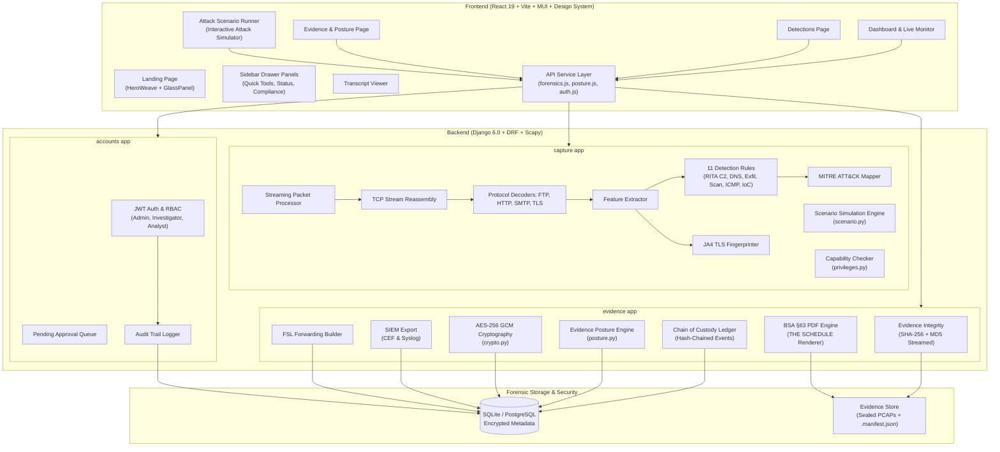
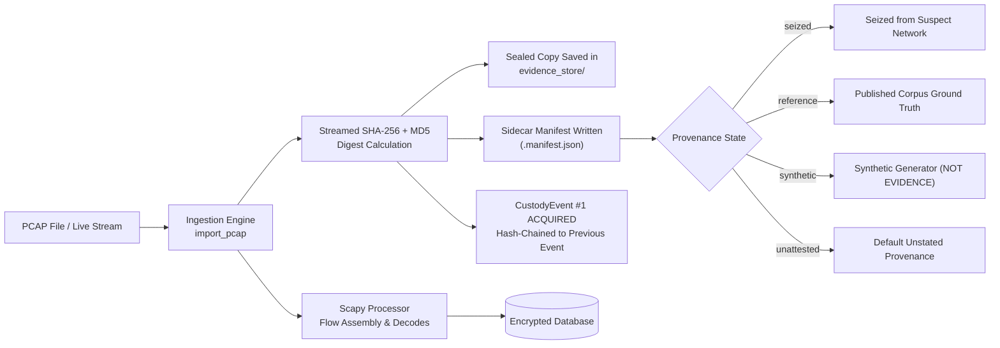
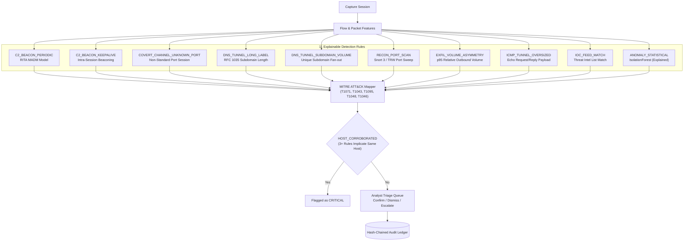
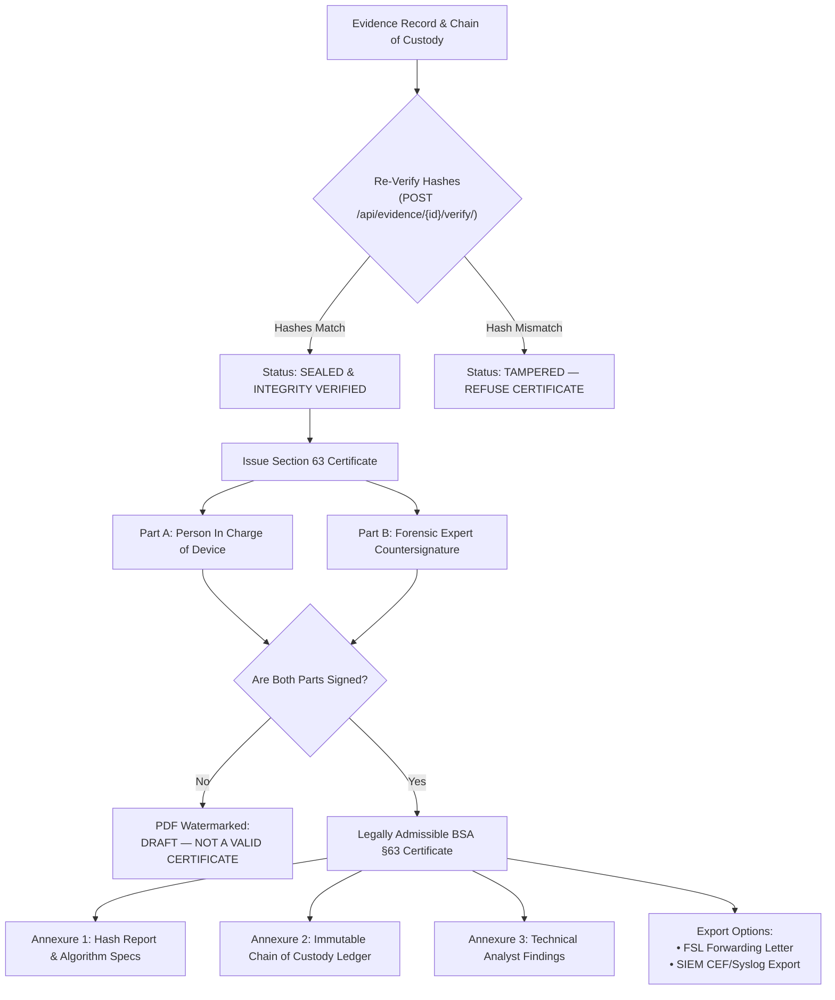

# NetForensiq

**Network and Packet Forensics Platform** — the chain-of-custody, evidence integrity, and legal admissibility layer that makes network evidence stand up in an Indian court under the **Bharatiya Sakshya Adhiniyam (BSA) 2023 §63**.

Built for **KANAD S.H.I.E.L.D. 2026** · Category 2, Problem Statement #8 (*Cyber Crime Investigation System*) · i-Hub Gujarat, Ahmedabad.

---

## Executive Overview

Standard forensic utilities like Wireshark, Arkime, Zeek, or Suricata analyze packet data. However, none of them produce a statutory **BSA Section 63 certificate**, maintain a cryptographic **hash-chained chain of custody**, or provide explainable detection rules where every threshold cites an authoritative reference.

NetForensiq bridges the critical gap between raw packet captures and judicial proof. It is an air-gapped, legal admissibility layer engineered for police cyber cells and forensic laboratories.

### The Network Evidence Gap

```mermaid
graph TD
    subgraph Scene ["Physical Crime Scene"]
        A["eSakshya App<br/>(Videographs scene & physical seizure)"]
    </div>

    subgraph Malkhana ["Police Malkhana"]
        B["CCTNS Property Register<br/>(Logs physical items: hard drives, phones)"]
    end

    subgraph Gap ["The Critical Legal Gap"]
        C["Network Evidence & Packet Captures<br/>(Volatile RAM, router SPAN taps, PCAPs)"]
    end

    subgraph Solution ["NetForensiq Legal Admissibility Layer"]
        D["Ingest & Hash (SHA-256 + MD5)"]
        E["Hash-Chained Chain of Custody"]
        F["11 Deterministic Detection Rules"]
        G["BSA §63 Statutory Certificate PDF"]
    end

    C -- "No physical scene to videograph" --> A
    C -- "No physical object for malkhana log" --> B
    C ==> "Sealed, Tracked & Certified By" ==> D
    D --> E --> F --> G
```

> **The Problem:** eSakshya seals *scene video*. CCTNS Property Registers track *physical hardware*. A packet capture is neither — it has no physical scene to videograph and cannot sit in a malkhana shelf. **Network evidence falls in the gap between the two systems, and NetForensiq bridges it.**

---

## Architecture & System Design

NetForensiq is built with a modular, decoupled architecture consisting of a React 19 frontend, Django 6.0 backend, Scapy streaming packet engine, and an air-gapped forensic evidence store.



---

## Forensic Processing & Legal Workflows

### 1. Ingestion, Manifest Provenance & Chain of Custody

When a PCAP is ingested (or live traffic is captured), NetForensiq calculates dual SHA-256 and MD5 cryptographic hashes on the fly without buffering the file in memory.



#### Manifest Provenance States
Every evidence record carries a mandatory manifest declaring its origin:

| Provenance | Meaning | Certificate Marking |
|---|---|---|
| `seized` | Declared at intake by an officer as taken from a target network | Standard Statutory Certificate |
| `reference` | Real traffic from a published corpus with verified ground truth | Reference Dataset Certificate |
| `synthetic` | Generated by internal simulation tools for testing | Watermarked: **SYNTHETIC DATA — NOT EVIDENCE** |
| `unattested` | Default when no statement of origin is provided | Unattested Exhibit Notice |

### 2. Detection Engine & MITRE ATT&CK Mapping

NetForensiq implements **11 explainable, rule-first detection algorithms**. Every finding cites its exact threshold and academic/vendor source.



### 3. BSA Section 63 Statutory Certification & Export

The PDF renderer reproduces **THE SCHEDULE** to Bharatiya Sakshya Adhiniyam 2023 verbatim.



---

## Quick Start

### Prerequisites
- Python 3.10+
- Node.js 18+
- SQLite (default) or PostgreSQL

### 1. Backend Setup

```bash
cd backend
python3 -m venv .venv
./.venv/bin/pip install -r requirements.txt
./.venv/bin/python manage.py migrate
```

Fetch real reference captures for validation:
```bash
./scripts/fetch_reference_captures.sh
```

Seed a complete demonstration case with synthetic and reference exhibits:
```bash
cd backend
./.venv/bin/python manage.py seed_demo --include-synthetic
./.venv/bin/python manage.py runserver 127.0.0.1:8000
```

### 2. Frontend Setup

```bash
cd frontend
npm install
npm run dev
```

### 3. Air-Gapped Deployment & Docker

NetForensiq is designed to operate on completely isolated forensic workstations with zero internet connectivity.

#### Option A: Offline Bundle Installation
On an internet-connected machine:
```bash
./scripts/build_offline_bundle.sh
# Generates build/netforensiq-offline-<version>.tar.gz containing pre-built wheels & static assets
```
On the air-gapped machine:
```bash
tar -xzf netforensiq-offline-<version>.tar.gz
cd netforensiq-offline-<version>
./scripts/install_offline.sh
```

#### Option B: Docker Containerized Deployment
```bash
# Build and launch via Docker Compose
docker-compose up -d --build

# Save Docker images for air-gapped transport
./scripts/airgap_save_images.sh

# Load Docker images on target workstation
./scripts/airgap_load_images.sh
```

---

## Detection Rules Reference

NetForensiq implements **11 Rule IDs** across **8 Rule Functions** and **35 Sourced Thresholds**:

| Rule ID | Category | Detection Mechanics | Threshold Source |
|---|---|---|---|
| `C2_BEACON_PERIODIC` | Command & Control | Inter-connection interval Bowley skew & MADM scoring | RITA `analyzer.go` MADM model |
| `C2_BEACON_KEEPALIVE` | Command & Control | Intra-session keepalive periodicity within a single TCP flow | RITA formula applied to intra-connection intervals `[OUR HEURISTIC]` |
| `COVERT_CHANNEL_UNKNOWN_PORT` | Command & Control | Sustained egress conversation on non-standard ports without TLS SNI | Curated sustained-session port registry `[OUR HEURISTIC]` |
| `DNS_TUNNEL_LONG_LABEL` | Exfiltration | Subdomain labels exceeding 52 characters with high entropy | RFC 1035 §2.3.4 (label ≤63); dnscat2 `MAX_FIELD_LENGTH=62`; iodine `-M` |
| `DNS_TUNNEL_SUBDOMAIN_VOLUME` | Exfiltration | High count of unique subdomains under a single parent domain | Scaled session volume threshold `[OUR HEURISTIC]` |
| `RECON_PORT_SCAN` | Reconnaissance | Fan-out port probing across single or multiple target hosts | Snort 3 `port_scan` (ports=25) & TRW algorithm (Jung et al. 2004) |
| `EXFIL_VOLUME_ASYMMETRY` | Exfiltration | Outbound-to-inbound volume asymmetry exceeding p95 of capture | Relative p95 threshold floored at 100 KB `[OUR HEURISTIC]` |
| `ICMP_TUNNEL_OVERSIZED` | Covert Channel | Echo payload size exceeding Linux/Windows ping baselines | Linux (56 B) / Windows (32 B) ping baselines + `[OUR HEURISTIC]` |
| `IOC_FEED_MATCH` | Threat Intelligence | Conversation matching imported threat intelligence feeds | CERT-In / FSL / abuse.ch IoC feeds |
| `ANOMALY_STATISTICAL` | Anomaly Detection | Unsupervised IsolationForest outlier scoring with feature z-scores | scikit-learn IsolationForest (capped at MEDIUM severity) |
| `HOST_CORROBORATED` | Multi-Vector | Single host address implicated by 3+ independent detection rules | Multi-rule corroboration logic `[OUR HEURISTIC]` |

---

## API Reference

### Capture & Detection API

| Method | Endpoint | Description |
|---|---|---|
| `GET` | `/api/sessions/` | List all capture sessions |
| `GET` | `/api/sessions/{id}/` | Session details & summary statistics |
| `POST` | `/api/sessions/{id}/analyse/` | Execute detection rules on session |
| `GET` | `/api/flows/` | List bidirectional flows (filterable by IP, port, protocol, severity) |
| `GET` | `/api/flows/{id}/` | Detailed flow features, payload entropy, and JA4 fingerprint |
| `GET` | `/api/detections/` | List detection findings with filter options |
| `POST` | `/api/detections/{id}/triage/` | Analyst triage: confirm, dismiss, or escalate |
| `GET` | `/api/detections/thresholds/` | Published threshold registry with provenance citations |

### Evidence, Posture & Statutory Certificates API

| Method | Endpoint | Description |
|---|---|---|
| `GET` | `/api/evidence/` | List sealed evidence records |
| `GET` | `/api/evidence/{id}/` | Detailed evidence record with SHA-256 & MD5 digests |
| `POST` | `/api/evidence/{id}/verify/` | Re-hash exhibit and compare against stored digest |
| `GET` | `/api/evidence/posture/` | Real-time statutory legal readiness & evidence posture score |
| `POST` | `/api/evidence/{id}/certificate/` | Issue BSA §63 Certificate draft |
| `POST` | `/api/certificates/{id}/sign/` | Sign certificate Part A (Device Admin) or Part B (Expert) |
| `GET` | `/api/certificates/{id}/pdf/` | Download rendered statutory BSA §63 Certificate PDF |
| `GET` | `/api/evidence/{id}/siem/` | Export evidence findings in SIEM CEF/Syslog format |
| `GET` | `/api/evidence/{id}/fsl/` | Generate FSL Forwarding Letter DOCX/PDF |

### Authentication & Account Administration API

| Method | Endpoint | Description |
|---|---|---|
| `POST` | `/api/auth/register/` | Register new investigator account (role, badge_id, department) |
| `POST` | `/api/auth/login/` | Obtain JWT access/refresh token pair |
| `GET` | `/api/auth/me/` | Current user profile details |
| `GET` | `/api/auth/accounts/pending/` | View pending registration applications (Admin only) |
| `POST` | `/api/auth/accounts/pending/` | Approve or reject pending account application |

---

## System Verification & Test Coverage

All statistics and counts in this documentation are programmatically verified against the codebase by `scripts/check_docs.py`.

```bash
# Run full suite verification (Backend + E2E + Doc check)
./scripts/verify.sh
```

- **358 Backend Unit Tests** — Scapy parsing, TCP stream reassembly, JA4 hashing, 11 detection rules, hash-chain integrity, BSA §63 certificate watermarking, AES-256 GCM encryption, posture calculation.
- **61 Playwright E2E Tests** — Complete UI user journeys, role-based access, triage workflows, evidence posture verification, air-gap network isolation assertions.

---

## Key Design Principles & Ground Rules

1. **No Hardcoded Demo Data:** Every metric on the dashboard originates from the database.
2. **Deterministic & Explainable Rules First:** Every threshold carries an explicit source citation or is tagged `[OUR HEURISTIC]`.
3. **Strict Provenance Tracking:** Evidence provenance (`seized`, `reference`, `synthetic`, `unattested`) is stored alongside the exhibit and printed on all statutory certificates.
4. **Air-Gap First Design:** Zero runtime internet dependencies; static assets, fonts, and dependencies are locally bundled.
5. **Measured & Checked Documentation:** All documented figures are programmatically verified via `scripts/check_docs.py`.

---

## License

Developed for the **KANAD S.H.I.E.L.D. 2026** Hackathon (i-Hub Gujarat). Licensing terms to be determined.
