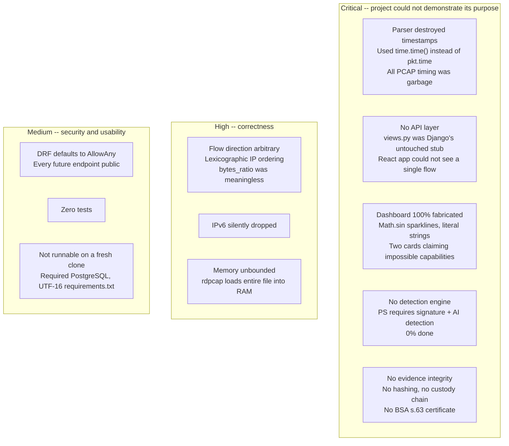
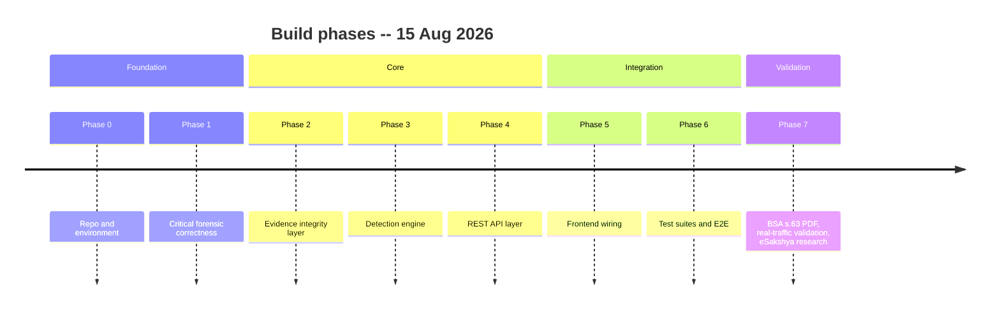
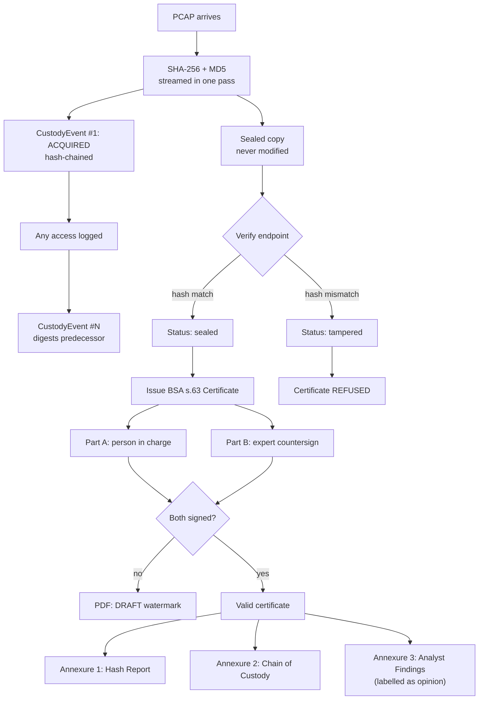
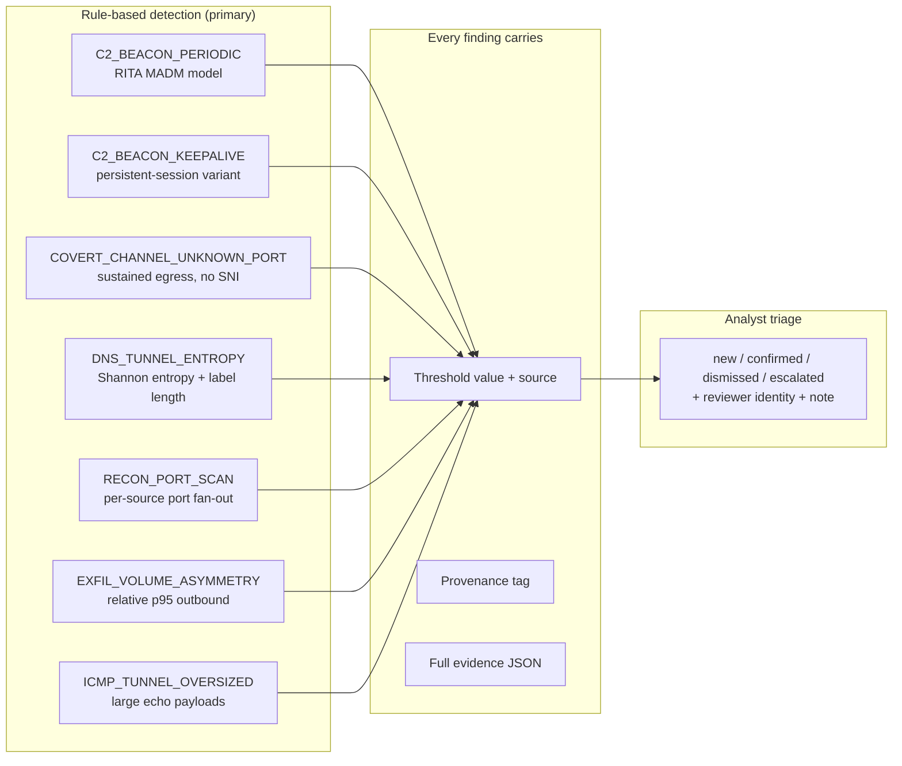
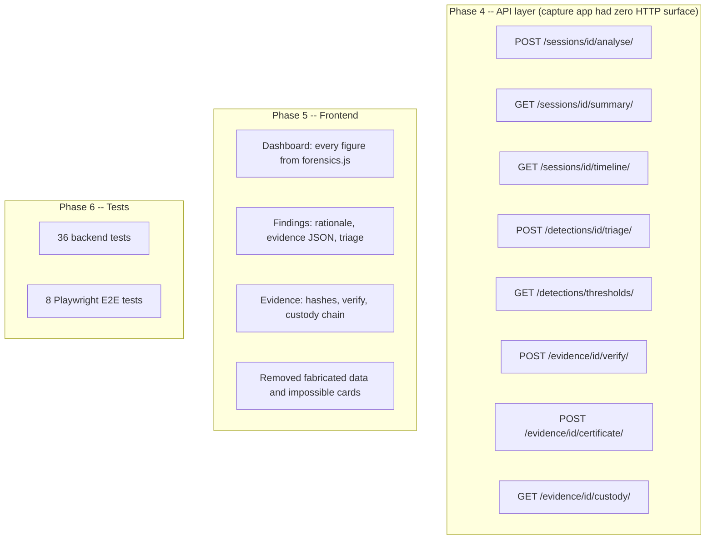
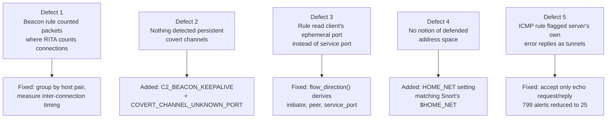
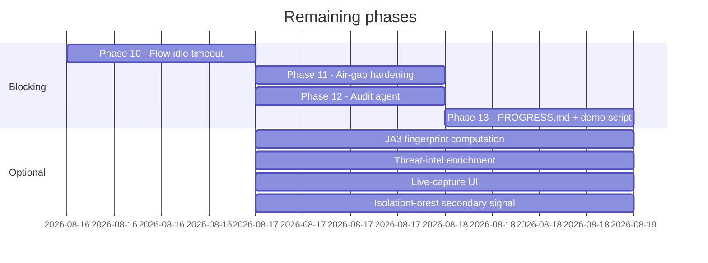

# NetForensiq — Project Analysis and Build History

**Last updated:** 16 Aug 2026
**Current HEAD:** `d92a4b6` (Phase 7) -- 14 commits
**Target event:** KANAD S.H.I.E.L.D. 2026, ~20 Aug 2026, i-Hub Gujarat, Ahmedabad

This document records the state of the project when it was inherited, every
improvement made since, the directions those improvements took, and what
remains to be done before the hackathon.

---

## Table of Contents

1. [What Was Inherited](#1-what-was-inherited)
2. [Improvements Made](#2-improvements-made)
3. [Quantitative Summary](#3-quantitative-summary)
4. [Remaining Work](#4-remaining-work)
5. [Strategic Positioning](#5-strategic-positioning)
6. [Research Index](#6-research-index)

---

## 1. What Was Inherited

Commit `120ccd9` (9 Aug 2026) — a single monolithic push by Muhammed Zuhayr.
Approximately 4,873 lines of code across 71 files.

### 1.1 Components That Were Genuinely Good

These were kept as-is or extended, never rewritten:

| Component | Why it mattered |
|---|---|
| Data model (`capture/models.py`) | Separated `CaptureSession` / `Flow` / `DNSRecord` with forensically literate fields: `ja3_hash`, `tls_sni`, `payload_entropy`, `longest_dns_label`, `tcp_flags_seen` |
| Scapy flow-assembly engine (`capture/processor.py`) | Working packet parser with a correct hand-rolled TLS ClientHello parser for SNI extraction |
| Synthetic traffic generator (`capture/synthetic.py`) | 5 labeled attack scenarios plus benign baseline, seedable for reproducibility |
| Auth system (`accounts/`) | Role + `badge_id` + department + admin approval + audit log -- well-matched to police deployment |
| Feature extraction (`capture/features.py`) | Shannon entropy and DNS subdomain features, correctly implemented with comments explaining rationale |

### 1.2 What Was Broken or Missing

The code review's verdict was **CONTINUE**: the hard, unglamorous parts (Scapy engine,
forensic schema, synthetic generator) were built well. What was missing was additive,
not a rewrite. Restarting would have discarded the two hardest components to rebuild
the same thing.

The full code review is at [research/93_NETFORENSIQ_CODE_REVIEW.md](../research/93_NETFORENSIQ_CODE_REVIEW.md).

---

## 2. Improvements Made

Work proceeded across 8 phases (0--7), spanning 5 directions of improvement.

### Direction 1: Forensic Correctness (Phases 0--1)

Fixing foundational bugs that made the tool scientifically unreliable.

**Timestamp fix.** The processor used `time.time()` at parse time, so every imported
PCAP was stamped with the import moment and all timing was destroyed. Now reads
`pkt.time`. Verification: the planted 30s C2 beacon round-trips as
`interval_median = 29.997 s`, `dispersion = 0.026`.

**Flow direction.** "Forward" was decided by lexicographic IP ordering, making
`bytes_ratio` (the exfiltration feature) semantically arbitrary. Direction is now
anchored to the connection initiator, confirmed by TCP SYN where available.

**Beacon periodicity.** Previously measured across both directions, alternating
a ~0.2s reply gap with the real ~30s period and hiding the beacon entirely.
Now measured on the outbound leg only. This bug was caught by testing, not inspection.

**Other fixes:**
- IPv6 no longer silently dropped
- `PcapReader` streaming replaces `rdpcap` to prevent OOM
- `capture_start` / `capture_end` recorded separately from processing time
- SQLite fallback so a fresh clone runs without a database server
- UTF-8 `requirements.txt` (was UTF-16, silently broke `pip install -r`)
- `.env.example` added
- DRF now denies by default (`IsAuthenticated`)
- Removed stray root `package.json` pulling abandoned 2013-era deps

### Direction 2: Legal and Evidence Compliance (Phases 2, 7)

Building the layer that makes network evidence admissible in an Indian court.

**Key design decisions:**

- **Part A / Part B is statutory**, not commentary: it is THE SCHEDULE to the BSA 2023,
  cross-referenced by s.63(4)(c), verified against indiacode.nic.in.
- The Schedule names SHA1/SHA256/MD5 explicitly — which is why MD5 is computed despite
  being weak, and never relied on alone.
- Field provenance is tagged `[STATUTORY]` / `[STANDARD]` / `[GOOD PRACTICE]` in the
  model, so we never claim legal backing we do not have.
- Statutory blanks stay blank for a human to complete in ink. Filling them with plausible
  values would be forging a statutory declaration.
- An unsigned certificate is watermarked `DRAFT -- NOT A VALID CERTIFICATE` across every page.

**Verification:** one appended byte flips status to `tampered`; editing custody entry #2
reports `entry #2: content has been altered`.

### Direction 3: Detection Engine (Phases 3, 7)

Rules first, model second -- because a police panel will ask "why did it flag this?"

**Threshold provenance:**
- Every detection parameter carries its source, published at `GET /api/detections/thresholds/`
- Values we invented are tagged `[OUR HEURISTIC]` and that tag travels into each finding
- Beaconing follows RITA's *current* `analyzer.go` (MADM / median interval), not its
  stale README (fixed divisor of 30)

**Aggregation and scaling:**
- DNS findings aggregate per (source, parent domain) — one alert per tunnel, not 54
  near-identical rows for a single tunnel
- Exfiltration volume is relative to the capture (p95 outbound, floored at 100 KB);
  a fixed byte threshold cannot work across capture scales
- `HOME_NET` setting (like Snort's `$HOME_NET`) ensures egress rules fire only when the
  initiator is inside the defended address space

**Verification on synthetic data:** all 5 planted attack types detected from 2,623
packets / 621 flows, as 7 findings — no alert fatigue.

### Direction 4: Full-Stack Wiring (Phases 4--6)

Connecting the engine to a usable product.

**Frontend changes:**
- Dashboard was entirely hardcoded (`Math.sin` sparklines, literal `"627.16 M"` strings).
  Every figure now traces to `services/forensics.js`.
- Deleted the "Blocked" and "Archived" stat cards — this is a passive tool that can do neither.
- Protocol bubbles sized by square-root-count so *area* is proportional; the old fixed
  percentages summed to 145%.
- Removed fabricated telemetry from the login splash ("Evidence sealed 2,417", "1.24 Gb/s").
- Sidebar linked to six routes that did not exist; only real routes remain.

**Bugs the tests caught:**
1. Beacon period read as 0.3s instead of 30s — intervals were measured across both directions
2. `triage_status` missing from the serializer, so triage controls never rendered
3. CORS allowed only `localhost:5173`, so the browser blocked every API call from the test origin
4. The E2E suite exhausted the 8/hour login throttle; now one login per run via a fixture

### Direction 5: Research and Intelligence (Phase 7)

Deep research that shaped positioning and caught dangerous errors.

**eSakshya gap analysis.** Three independent methods answered the decisive question:

| Method | Result |
|---|---|
| Gemini — screen-by-screen audit | Malkhana, custody, transfer, handover, exhibit logging, FSL forwarding all NOT FOUND |
| ChatGPT — rules and SOPs | Maharashtra e-Sakshya Rules 2025 and all guidance silent on post-seizure custody |
| Grok — 14 months of X | Zero posts discussing custody transfer inside eSakshya, from anyone |

**Verification against primary sources.** Every load-bearing claim was checked:
- Caught ChatGPT converting an advocate's argument into a judicial holding
  (*Mani Roy v. State of H.P.*) — the single most dangerous error in the research set
- Verified BSA s.63 Schedule verbatim from indiacode.nic.in
- Verified *Shadab v. State of U.P.* and *Suresh v. State of Kerala* judgments
- Verified GSJA Master Trainer Programme (July 2026) — Gujarat judges are being
  trained right now to expect digital evidence with an ID, a hash, and a s.63 certificate

**Real-traffic validation.** Two captures from malware-traffic-analysis.net:

| Metric | AsyncRAT capture (true positives) | Server week (false positives) |
|---|---|---|
| Before fixes | 0 detections | 7,052 detections |
| After fixes | 5 (all documented C2) | 262 |

Five defects found, all invisible to the synthetic corpus:

Full details: [research/96_REAL_TRAFFIC_VALIDATION.md](../research/96_REAL_TRAFFIC_VALIDATION.md)

---

## 3. Quantitative Summary

| Metric | At clone (`120ccd9`) | Now (`d92a4b6`) |
|---|---|---|
| Backend tests | 0 | 54 |
| E2E tests | 0 | 10 |
| Detection rules | 0 | 7 |
| API endpoints (capture + evidence) | 0 | 8+ REST endpoints |
| Frontend pages (functional) | 1 (login only) | 4 (login, dashboard, findings, evidence) |
| Evidence integrity | None | SHA-256 + MD5, hash-chain custody, BSA s.63 PDF |
| Research documents | 0 | 19 files, ~9,110 lines |
| Total diff since clone | -- | 76 files changed, +30,028 / -1,036 lines |

---

## 4. Remaining Work

Four phases remain before the hackathon, plus optional items that are not blocking.

### Phase 10: Flow Idle Timeout

Defect 5 from real data -- found but **not fixed**. Reused ephemeral ports merge
separate conversations into one "flow." The server capture has flows claiming
22,736s duration carrying 148 bytes. A judge asking "why is this flow six hours
long?" has no good answer right now.

### Phase 11: Air-Gap Hardening

The demo is at i-Hub Gujarat -- no guaranteed internet. Pre-cache anything
network-dependent. Prove the whole stack runs with the interface down.

### Phase 12: Audit Agent

Requested in the original build directive and has never run once. The `AuditLog`
model and action enum exist; the agent that uses them does not.

### Phase 13: PROGRESS.md and Demo Script

PROGRESS.md is now two phases stale. The positioning changed materially -- the
"nobody else issues a s.63 certificate" claim is dead and needs replacing with
the narrowed, defensible version.

### Optional (not blocking)

| Item | Status |
|---|---|
| JA3 fingerprint computation | Spec verified in SPEC_02, field exists in model, not yet populated |
| Threat-intel enrichment | abuse.ch SSLBL JA3 list, Tranco whitelist, Public Suffix List -- all offline-capable |
| Live-capture UI | Management command exists; no HTTP trigger |
| IsolationForest | As a clearly-labelled secondary signal, not primary detection |

---

## 5. Strategic Positioning

eSakshya seals scene video. CCTNS Property Registers track physical objects. A
packet capture is neither -- it has no scene to videograph and no object to log
into a malkhana.

**Network evidence falls in the gap between the two systems, and nothing currently
covers it.**

Gujarat judges are being trained right now (GSJA Master Trainer Programme, July 2026)
to expect digital evidence in a specific shape: an ID, a hash, and a s.63 certificate.
NetForensiq deliberately mirrors that shape for network evidence -- not imitation, but
landing in a mental model the local judiciary already has.

---

## 6. Research Index

The research corpus spans 19 documents:

| File | Content |
|---|---|
| `SPEC_01_EVIDENCE_INTEGRITY.md` | BSA s.63 verbatim, THE SCHEDULE field list, schema |
| `SPEC_02_DETECTION_ALGORITHMS.md` | RITA/Snort/binwalk/JA3 parameters with sources |
| `SPEC_03_CONNECTORS_AND_MCP.md` | Open feeds worth wiring in; Indian gov APIs |
| `93_NETFORENSIQ_CODE_REVIEW.md` | End-to-end code review that produced the build plan |
| `94_ESAKSHYA_RESEARCH_PROMPTS.md` | Prompts used for eSakshya external research |
| `95_ESAKSHYA_VERIFIED_FINDINGS.md` | eSakshya gap analysis, claim-by-claim verification |
| `96_REAL_TRAFFIC_VALIDATION.md` | Real-traffic test results and 5 defects found |
| `00_MASTER_INDEX.md` | Index of the background research corpus |
| `01_*` through `03_*` | Gujarat police structure, existing tech, cybercrime landscape |
| `90_SYNTHESIS_AND_OPPORTUNITY_MAP.md` | Synthesis of background research |
| `91_EXTERNAL_LLM_RESEARCH_PROMPTS.md` | Prompts used for external LLM research |
| `92_EXTERNAL_LLM_MERGED_FINDINGS.md` | Merged findings from external LLM research |
| `PS_00_*` through `PS_04_*` | Problem statement research (official, prior art, buildable stack, legal, organisers) |
